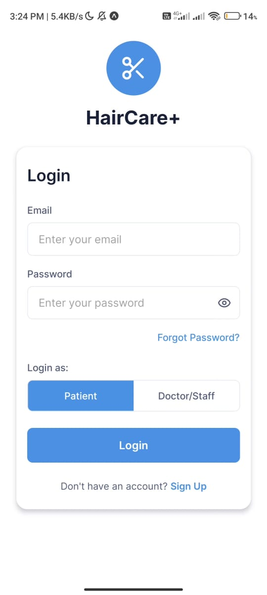
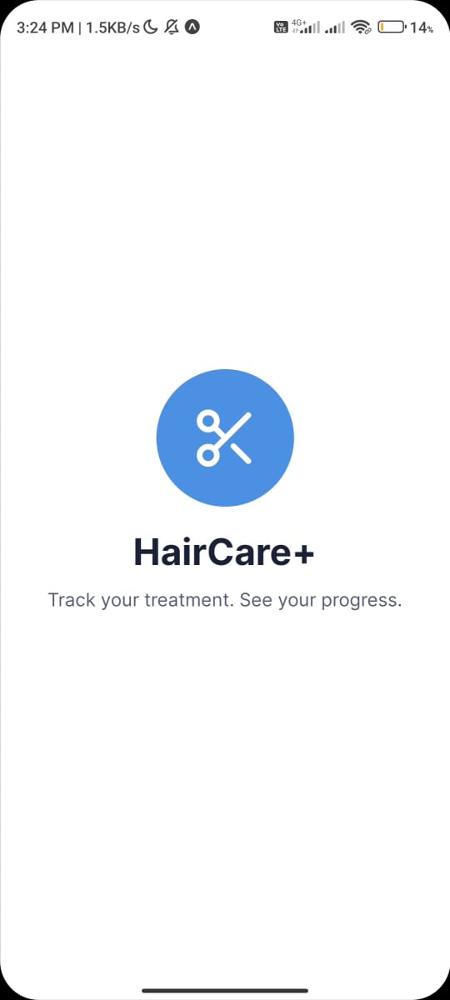
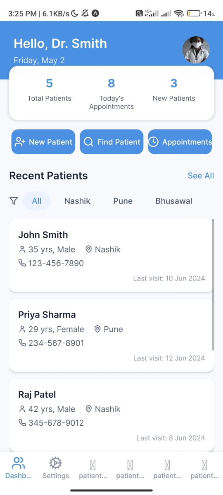
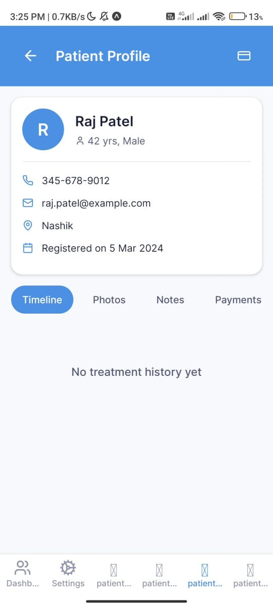

# 💇‍♀️ HairCare+ – Hair Clinic Management System (Frontend)

> A modern, **mobile-first React Native app** (frontend-only) built with **Expo** and **TypeScript** for managing hair clinic workflows.  
> Designed for two user roles: **Doctor/Receptionist** and **Patient**, it helps track treatment progress, upload patient photos, and generate visual reports.

---

## 📱 Features (Frontend)

### 🔐 Authentication UI
- Login/Signup screens with role selection (Doctor or Patient)
- Forgot Password screen
- Onboarding walkthrough to introduce app features
- Splash screen with logo and tagline

### 👨‍⚕️ Doctor / Receptionist Interface
- **Dashboard** with:
  - Add New Patient
  - View Existing Patients
  - Recent Activity
  - Payment Records
- Patient Type Selector (New / Existing)
- Add New Patient Form
- Search Patient
- Patient Profile includes:
  - Treatment Timeline (sessions, notes, uploads)
  - Photo Upload (Front / Left / Right / Back views with notes)
  - Payment Summary
  - Export Report (UI only – PDF button)
- Settings screen

### 👤 Patient Interface
- Dashboard: “My Treatment”, “Download Reports”
- Visual Treatment Timeline
- Report Download Center (PDF/Image – UI only)

---

## 🖼️ Screenshots


| Splash Screen | Login Screen | Doctor Dashboard | Patient Dashboard |
|---------------|---------------|------------------|------------------|
|  |  |  |  |

---

## 🚀 Getting Started

### 1. Clone the repository

```bash
git clone https://github.com/your-username/HairCarePlus.git
cd HairCarePlus

npm install
# or
yarn npx expo start
```

📌 Notes
This is a frontend-only version.

All features currently use mocked data or static content.

PDF generation, image uploads, and authentication are UI-only at this stage.

Backend integration is planned in the next version.

---

📅 Upcoming Milestones
✅ Connect to Firebase Authentication and Firestore

✅ Enable real image uploads using Firebase Storage

✅ Add dynamic PDF report generation

✅ Implement push notifications for appointments
